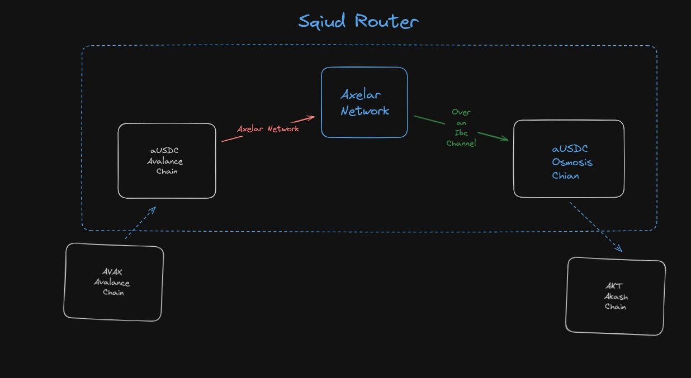

# Paymos
PayMos is the all in one solution to convert your fiat currency to AKT seamlessly. It's completely automated, so you can take a backseat and let PayMos handle the conversions for you.

### How It works
Paymos integrates transack which a trusted onramp in game. Here the user converts
his fiat to AKT tokens. A user first buys some AVAX why?
#### Reason for chosing AVAX
- The market for AVAX may be more liquid than that of OSMO. This implies that trading AVAX for other currencies, such as AKT, may be quicker and simpler. If you wish to transact rapidly or with a substantial sum of money, having a more liquid coin may be crucial. 

- Facing issues with converting to osmo directly on transack on the testnet.As this project is just to show a insfratucture to support the FIAT to AKT conversion.Thus we chose conversion of AVAX to OSMO. *I cannot directly convert to send to AKT as there are no conversion route to SANDBOX akt.I contacted the AXELAR and SQUID team and they said there are no relayers active for the conversion*

#### Conversion Flow
There are few steps in the conversion.  
- The user first goes through an onramp converting his token to AVAX on Avalanch chain
- These tokens are swapped to OSMO via the squid router . It takes the following path


### Future Goals
- We can make the AKT token interchain via Axelar Networks Inter Chain Service
- Curently we imploy Transack which can be replace by an inhouse on ramp

## Running
```bash
yarn # Install the dependencies
yarn dev # Start the server
```